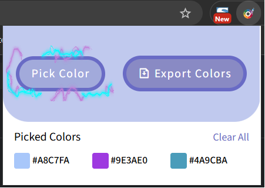

# WebExtension-ColorPick

A browser extension that allows users to pick colors from any webpage, save them, view their HEX and RGB values, copy them to the clipboard, and export the list as a text file. Built using HTML, CSS, and JavaScript, leveraging modern browser APIs like EyeDropper and Clipboard.

---

## Screenshots

---

## Features

- **Pick Colors:** Use the EyeDropper tool to select any color from the screen.
- **Save Colors:** Picked colors are saved and persist across browser sessions.
- **View Details:** See HEX and RGB values for each picked color.
- **Copy to Clipboard:** Click on a color value to copy it.
- **Export Colors:** Download your color list as a text file.
- **Clear List:** Remove all saved colors with one click.
- **Pop-up Details:** Click a color to view a detailed pop-up with copy options.

---

## Files

- `manifest.json` — Extension manifest file (metadata, permissions, etc.)
- `script.js` — Main JavaScript logic for color picking, UI, and storage.
- `index.html` — Main extension popup UI.
- `style.css` — Styles for the popup UI.
- `icons/` — Folder containing extension icons.

---

## How It Works

1. **Pick a Color:**  
   Click the "Pick Color" button. The EyeDropper tool activates, letting you select any color on the page.

2. **Save & Display:**  
   The selected color is added to your saved list, shown in the popup with its HEX and RGB values.

3. **Copy Values:**  
   Click on a HEX or RGB value to copy it to your clipboard.

4. **Export List:**  
   Click "Export" to download all saved colors as a text file.

5. **Clear List:**  
   Click "Clear" to remove all saved colors.

6. **Pop-up Details:**  
   Click a color in the list to open a pop-up with detailed info and copy options.

---

## Installation

1. Clone or download this repository.
2. Open your browser’s Extensions page (e.g., `chrome://extensions/`).
3. Enable "Developer mode".
4. Click "Load unpacked" and select this project folder.

---

## Technologies Used

- HTML5
- CSS3
- JavaScript (ES6+)
- [EyeDropper API](https://developer.mozilla.org/en-US/docs/Web/API/EyeDropper)
- [Clipboard API](https://developer.mozilla.org/en-US/docs/Web/API/Clipboard_API)
- [Blob API](https://developer.mozilla.org/en-US/docs/Web/API/Blob)
- Local Storage
